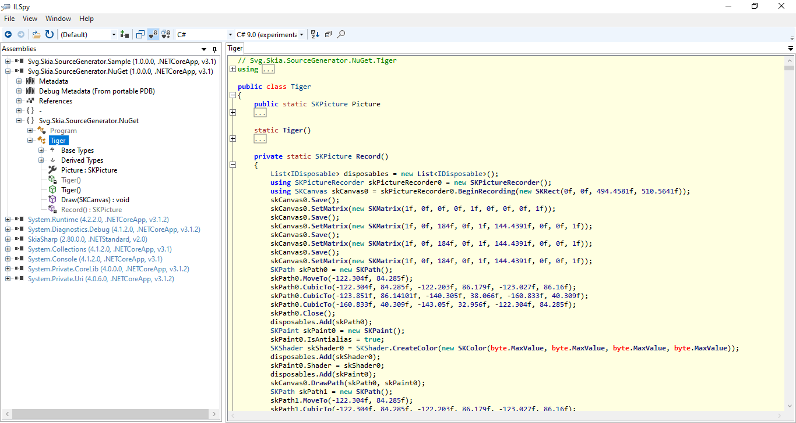

# Svg.Skia

[](https://gitter.im/wieslawsoltes/Svg.Skia?utm_source=badge&utm_medium=badge&utm_campaign=pr-badge)

[](https://dev.azure.com/wieslawsoltes/GitHub/_build/latest?definitionId=76)


[](https://www.nuget.org/packages/svg.skia)
[](https://www.nuget.org/packages/svg.skia)
[](https://www.myget.org/gallery/svgskia-nightly)

[](https://github.com/wieslawsoltes/svg.skia)
[](https://github.com/wieslawsoltes/svg.skia)
[](https://github.com/wieslawsoltes/svg.skia)

*Svg.Skia* is an [SVG](https://en.wikipedia.org/wiki/Scalable_Vector_Graphics) rendering library.

## About

*Svg.Skia* can be used as a .NET library or as a CLI application
to render SVG files based on a [static](http://www.w3.org/TR/SVG11/feature#SVG-static)
[SVG Full 1.1](https://www.w3.org/TR/SVG11/) subset to raster images or
to a backend's canvas.

The `Svg.Skia` is using [SVG](https://github.com/vvvv/SVG) library to load `Svg` object model. 

The `Svg.Skia` library is implemented using `SkiaSharp` rendering backend that aims to be on par 
or more complete then original `System.Drawing` implementation and more performant and cross-platform.

The `Svg.Skia` can be used in same way as the [SkiaSharp.Extended.Svg](https://github.com/mono/SkiaSharp.Extended/tree/master/SkiaSharp.Extended.Svg) 
(load `svg` files as `SKPicture`). 

The `Svg` library has more complete implementation of `Svg` document model then [SkiaSharp.Extended.Svg](https://github.com/mono/SkiaSharp.Extended/tree/master/SkiaSharp.Extended.Svg)
and the `Svg.Skia` renderer will provide more complete rendering subsystem implementation.

## NuGet

Svg.Skia is delivered as a NuGet package.

You can find the packages here [NuGet](https://www.nuget.org/packages/Svg.Skia/) and install the package like this:

`Install-Package Svg.Skia`

or by using nightly build feed:
* Add `https://www.myget.org/F/svgskia-nightly/api/v2` to your package sources
* Alternative nightly build feed `https://pkgs.dev.azure.com/wieslawsoltes/GitHub/_packaging/Nightly/nuget/v3/index.json`
* Update your package using `Svg.Skia` feed

and install the package like this:

`Install-Package Svg.Skia -Pre`

## Usage

### Library

#### Install Package

```
dotnet add package Svg.Skia
```

```
Install-Package Svg.Skia
```

#### Draw on Canvas

```C#
using SkiaSharp;
using Svg.Skia;

var svg = new SKSvg();

svg.Load("image.svg");

SKCanvas canvas = ...
canvas.DrawPicture(svg.Picture);
```

#### Save as Png

```C#
using SkiaSharp;
using Svg.Skia;

using (var svg = new SKSvg())
{
    if (svg.Load("image.svg") is { })
    {
        svg.Save("image.png", SKEncodedImageFormat.Png, 100, 1f, 1f);
    }
}
```

```C#
using System.IO;
using SkiaSharp;
using Svg.Skia;

using (var svg = new SKSvg())
{
    if (svg.Load("image.svg") is { })
    {
        using (var stream = File.OpenWrite("image.png"))
        {
            svg.Picture.ToImage(stream, SKColors.Empty, SKEncodedImageFormat.Png, 100, 1f, 1f);
        }
    }
}
```

```C#
using SkiaSharp;
using Svg.Skia;

using (var svg = new SKSvg())
{
    if (svg.Load("image.svgz") is { })
    {
        svg.Save("image.png", SKEncodedImageFormat.Png, 100, 1f, 1f);
    }
}
```

```C#
using System.IO;
using SkiaSharp;
using Svg.Skia;

using (var svg = new SKSvg())
{
    if (svg.Load("image.svgz") is { })
    {
        using (var stream = File.OpenWrite("image.png"))
        {
            svg.Picture.ToImage(stream, SKColors.Empty, SKEncodedImageFormat.Png, 100, 1f, 1f);
        }
    }
}
```

#### Save as Pdf

```C#
using SkiaSharp;
using Svg.Skia;

using (var svg = new SKSvg())
{
    if (svg.Load("image.svg") is { })
    {
        svg.Picture.ToPdf("image.pdf", SKColors.Empty, 1f, 1f);
    }
}
```

#### Save as Xps

```C#
using SkiaSharp;
using Svg.Skia;

using (var svg = new SKSvg())
{
    if (svg.Load("image.svg") is { })
    {
        svg.Picture.ToXps("image.xps", SKColors.Empty, 1f, 1f);
    }
}
```

### AvaloniaUI

You need to use `0.10.0-preview6` version of AvaloniaUI.

#### Install Package

```
dotnet add package Avalonia.Svg.Skia
```

```
Install-Package Avalonia.Svg.Skia
```

#### Add namespace to XAML

```XAML
<UseControl xmlns="https://github.com/avaloniaui"
            xmlns:svg="clr-namespace:Avalonia.Svg.Skia;assembly=Avalonia.Svg.Skia">
```

#### Set Image.Source

```XAML
<Image>
   <Image.Source>
       <svg:SvgImage Source="/Assets/__AJ_Digital_Camera.svg"/>
   </Image.Source>
</Image>
```

### Use Resources

```XAML
<UserControl.Resources>
    <svg:SvgImage x:Key="__tiger" Source="/Assets/__tiger.svg"/>
</UserControl.Resources>
```

```XAML
<Image Name="svgResourceImage" Source="{DynamicResource __tiger}"/>
```

### Tool

```
dotnet tool install -g Svg.Skia.Converter
```

```
Svg.Skia.Converter:
  Converts a svg file to an encoded bitmap image.

Usage:
  Svg.Skia.Converter [options]

Options:
  -f, --inputFiles <inputfiles>              The relative or absolute path to the input files
  -d, --inputDirectory <inputdirectory>      The relative or absolute path to the input directory
  -o, --outputDirectory <outputdirectory>    The relative or absolute path to the output directory
  --outputFiles <outputfiles>                The relative or absolute path to the output files
  -p, --pattern <pattern>                    The search string to match against the names of files in the input directory
  --format <format>                          The output image format
  -q, --quality <quality>                    The output image quality
  -b, --background <background>              The output image background
  -s, --scale <scale>                        The output image horizontal and vertical scaling factor
  --scaleX, -sx <scalex>                     The output image horizontal scaling factor
  --scaleY, -sy <scaley>                     The output image vertical scaling factor
  --systemLanguage <systemlanguage>          The system language name as defined in BCP 47
  --quiet                                    Set verbosity level to quiet
  -c, --load-config <load-config>            The relative or absolute path to the config file
  --save-config <save-config>                The relative or absolute path to the config file
  --version                                  Show version information
  -?, -h, --help                             Show help and usage information
```

Supported formats: png, jpg, jpeg, webp, pdf, xps

## SVG to C# Compiler

### About

SVGC compiles SVG drawing markup to C# using SkiaSharp as rendering engine. SVGC can be also used as codegen for upcoming C# 9 Source Generator feature.

[](images/Demo.png)

### NuGet

* https://www.nuget.org/packages/Svg.SourceGenerator.Skia
* https://www.nuget.org/packages/svgc
* https://www.nuget.org/packages/Svg.CodeGen.Skia

### Source Generator Usage

Add NuGet package reference to your `csproj`.

```xml
<PropertyGroup>
  <OutputType>Exe</OutputType>
  <TargetFramework>net5.0</TargetFramework>
  <LangVersion>preview</LangVersion>
</PropertyGroup>
```

```xml
<ItemGroup>
  <PackageReference Include="Svg.SourceGenerator.Skia" Version="0.4.2-preview8" />
</ItemGroup>
```

Include `svg` assets file in your `csproj`.

```xml
<ItemGroup>
  <AdditionalFiles Include="Assets/Sample.svg" NamespaceName="Assets" ClassName="Sample" />
</ItemGroup>
```

Use generated `SKPicture` using static `Picture` property from `Sample` class.

```C#
using SkiaSharp;
using Assets;

public void Draw(SKCanvas canvas)
{
    canvas.DrawPicture(Sample.Picture);
}
```

### Avalonia Usage

`csproj`
```xml
<ItemGroup>
  <AdditionalFiles Include="Assets/__tiger.svg" NamespaceName="AvaloniaSample" ClassName="Tiger" />
</ItemGroup>
```
```xml
<ItemGroup>
  <PackageReference Include="Svg.SourceGenerator.Skia" Version="0.4.2-preview8" />
  <PackageReference Include="Avalonia.SKPictureImage" Version="0.4.2-preview8" />
</ItemGroup>
```

`xaml`
```xaml
<Window xmlns="https://github.com/avaloniaui"
        xmlns:x="http://schemas.microsoft.com/winfx/2006/xaml"
        xmlns:d="http://schemas.microsoft.com/expression/blend/2008"
        xmlns:mc="http://schemas.openxmlformats.org/markup-compatibility/2006"
        xmlns:local="clr-namespace:AvaloniaSample;assembly=AvaloniaSample"
        xmlns:skp="clr-namespace:Avalonia.SKPictureImage;assembly=Avalonia.SKPictureImage"
        mc:Ignorable="d" d:DesignWidth="800" d:DesignHeight="450"
        Width="900" Height="650" WindowStartupLocation="CenterScreen"
        x:Class="AvaloniaSample.MainWindow"
        Title="AvaloniaSample">
    <Window.Resources>
        <skp:SKPictureImage x:Key="TigeImage" Source="{x:Static local:Tiger.Picture}" />
    </Window.Resources>
    <Grid>
        <Image Source="{StaticResource TigeImage}" />
    </Grid>
</Window>
```

### svgc Usage

```
svgc:
  Converts a svg file to a C# code.

Usage:
  svgc [options]

Options:
  -i, --inputFile <inputfile>      The relative or absolute path to the input file [default: ]
  -o, --outputFile <outputfile>    The relative or absolute path to the output file [default: ]
  -j, --jsonFile <jsonfile>        The relative or absolute path to the json file [default: ]
  -n, --namespace <namespace>      The generated C# namespace name [default: Svg]
  -c, --class <class>              The generated C# class name [default: Generated]
  --version                        Show version information
  -?, -h, --help                   Show help and usage information
```

Json File Format
```json
[
    { "InputFile":"file1.svg", "OutputFile":"file1.svg.cs", "Class":"ClassName1", "Namespace":"NamespaceName" },
    { "InputFile":"file2.svg", "OutputFile":"file2.svg.cs", "Class":"ClassName2", "Namespace":"NamespaceName" }
]
```

### Links

* [Source Generators Cookbook](https://github.com/dotnet/roslyn/blob/master/docs/features/source-generators.cookbook.md)
* [Source Generators](https://github.com/dotnet/roslyn/blob/master/docs/features/source-generators.md)
* [Source Generators Samples](https://github.com/dotnet/roslyn-sdk/tree/master/samples/CSharp/SourceGenerators)
* [Introducing C# Source Generators](https://devblogs.microsoft.com/dotnet/introducing-c-source-generators/)

## Build

To build the projects you need to install [.NET 5.0](https://dotnet.microsoft.com/download/dotnet/5.0) version `SDK 5.0.100`.

```
git clone git@github.com:wieslawsoltes/Svg.Skia.git
cd Svg.Skia
git submodule update --init --recursive
dotnet build -c Release
```

### Publish Managed

```
cd ./src/Svg.Skia.Converter
dotnet publish -c Release -f net5.0 -r win7-x64 /p:PublishTrimmed=True /p:PublishReadyToRun=True -o Svg.Skia.Converter_net5.0_win7-x64
```

```
cd ./src/Svg.Skia.Converter
dotnet publish -c Release -f net5.0 -r ubuntu.14.04-x64 /p:PublishTrimmed=True /p:PublishReadyToRun=True -o Svg.Skia.Converter_net5.0_ubuntu.14.04-x64
```

```
cd ./src/Svg.Skia.Converter
dotnet publish -c Release -f net5.0 -r osx.10.12-x64 /p:PublishTrimmed=True /p:PublishReadyToRun=True -o Svg.Skia.Converter_net5.0_osx.10.12-x64
```

```
cd ./src/Svg.Skia.Converter
dotnet publish -c Release -f net5.0 -r debian.8-x64 /p:PublishTrimmed=True /p:PublishReadyToRun=True -o Svg.Skia.Converter_net5.0_debian.8-x64
```

```
cd ./src/SvgToPng
dotnet publish -c Release -f net5.0 -r win7-x64 -o SvgToPng_net5.0_win7-x64
```

```
cd ./src/SvgToPng
dotnet publish -c Release -f net461 -r win7-x64 -o SvgToPng_net461_win7-x64
```

```
cd ./src/SvgXml.Diagnostics
dotnet publish -c Release -f net5.0 -r win7-x64 -o SvgXml.Diagnostics_net5.0_win7-x64
```

### Publish Native

```
cd ./src/Svg.Skia.Converter
dotnet publish -c Release -f net5.0 -r win-x64 -o Svg.Skia.Converter_net5.0_win-x64
```

```
cd ./src/Svg.Skia.Converter
dotnet publish -c Release -f net5.0 -r linux-x64 -o Svg.Skia.Converter_net5.0_linux-x64
```

```
cd ./src/Svg.Skia.Converter
dotnet publish -c Release -f net5.0 -r osx-x64 -o Svg.Skia.Converter_net5.0_osx-x64
```

## Externals

The `Svg.Skia` library is using code from the https://github.com/vvvv/SVG

## License

Parts of Svg.Skia source code are adapted from the https://github.com/vvvv/SVG

Svg.Skia is licensed under the [MIT license](LICENSE.TXT).
